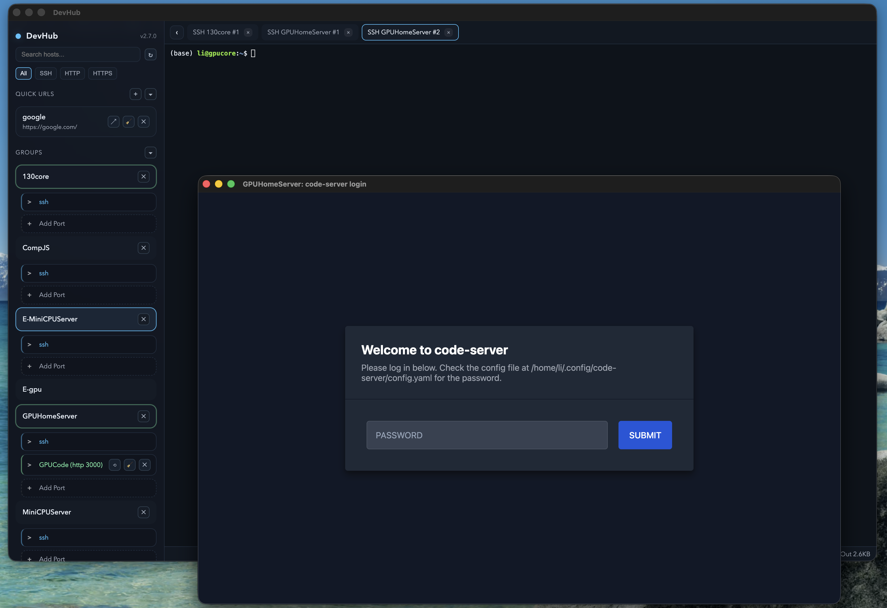

# DevHub

DevHub makes remote dev services feel local — **full web windows per service**, **SSH tunnels managed for you**, and **no VPN required**.

## What’s new in 2.7.2

- **tmux per host**: launch persistent terminal sessions directly from the sidebar.

---

## The problem it solves

Working on remote hosts usually means:
- remembering `ssh -L` commands
- juggling ports and aliases
- losing sessions when tunnels drop
- sharing one browser session across multiple services

DevHub removes the busywork. Choose a host, add a port, and DevHub opens the service in its own **full WebView window** — cookies, auth, WebSockets, and storage all intact.

---

## Why I built it

I wanted a workflow where **services are first‑class**, not just terminals and files. VS Code is great for code, but it still leaves you managing tunnels and service windows manually. DevHub makes the **service layer** effortless.

Best use: run **code-server** on your remote host and open it in DevHub. Everything runs remotely, but it’s **managed locally** with clean, isolated windows.

---

## How it works (high level)

- Hosts come from your `~/.ssh/config` (including ProxyJump/ProxyCommand)
- Each service (port + protocol + alias) gets its **own SSH forward**
- Each service opens in its **own WebView window**
- DevHub keeps tunnels alive and restores them if they drop
- **No VPN** — just standard SSH

---

## DevHub vs VS Code

**VS Code** is workspace‑oriented: files, repos, editors.  
**DevHub** is service‑oriented: dashboards, APIs, code-server, admin UIs.

They are complementary:
- Use VS Code to edit code
- Use DevHub to open and manage the services that code runs

---

## Key features

- **Full web experience** per service (no iframe)
- **One SSH forward per service** for isolation and stability
- **Auto‑reconnect** for dropped tunnels
- **SSH terminal tabs** inside the main window, shared tunnels and status footer
- **tmux sessions** per host (persistent terminals)
- **Quick URLs**: open and reuse full webviews without a host
- **Protocol filters** (SSH / HTTP / HTTPS) in the sidebar
- **Tray menu** for quick access to active sessions
- **No VPN required**
- **Best with code-server**: run remote, manage locally

---

## Quick start

Requirements:
- macOS (primary), Windows supported via Electron Builder
- SSH config with named hosts (`~/.ssh/config`)

Use:
1. Launch DevHub.
2. Pick a host from `~/.ssh/config`.
3. Add a service (HTTP/HTTPS + port + optional alias).
4. The service opens in its own window with its own tunnel.
5. Re‑click to reuse the same window/session.

---

## Changelog

See `CHANGELOG.md`.
